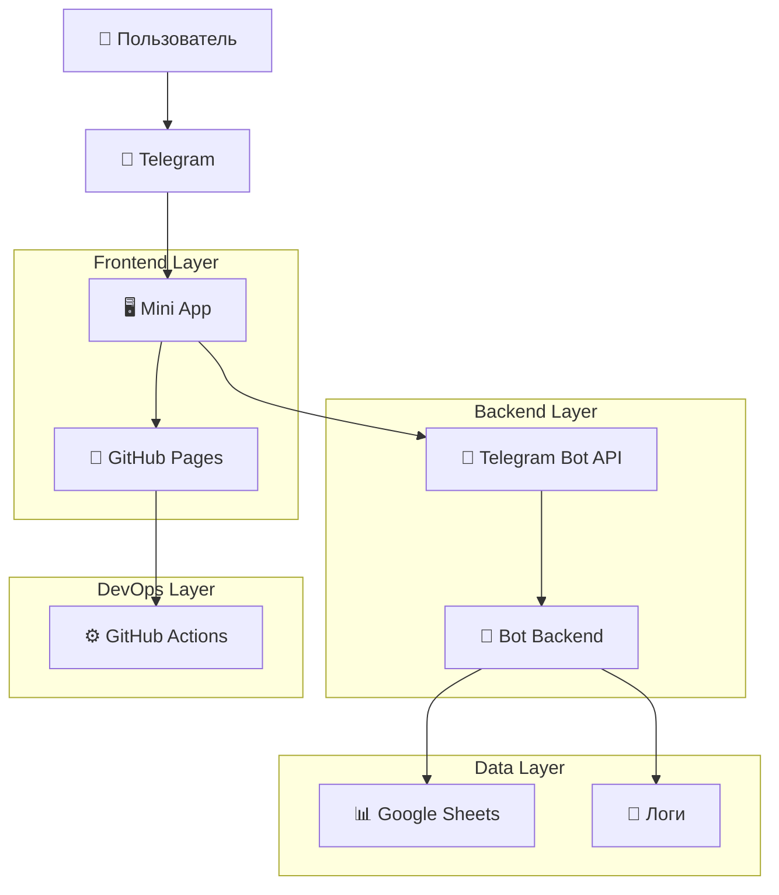
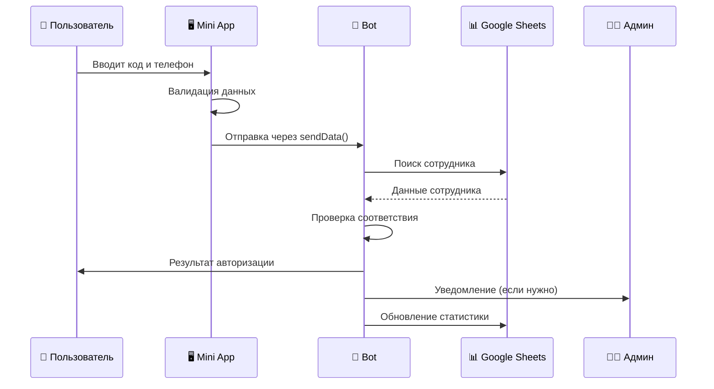

# 🏗️ Архитектура проекта

> **Последнее обновление:** 05.09.2025  
> **Версия архитектуры:** 1.0.0

## 📋 Обзор системы

**Marketing Test** - это система авторизации сотрудников через Telegram Mini App с интеграцией Google Sheets для валидации данных.

### Ключевые компоненты
1. **Frontend**: Telegram Mini App (HTML/CSS/JS)
2. **Backend**: Telegram Bot (планируется)
3. **Storage**: Google Sheets
4. **Deployment**: GitHub Pages + GitHub Actions

## 🎯 Архитектурные принципы

### 1. Простота и минимализм
- Vanilla JavaScript без фреймворков
- Минимальные зависимости
- Прямые API интеграции

### 2. Безопасность
- Telegram Web App data validation
- Секретные данные только в переменных окружения
- Нет чувствительной информации в frontend

### 3. Производительность
- Легковесный frontend (< 20KB)
- Кэширование статических ресурсов
- Оптимизированные изображения и ресурсы

### 4. Масштабируемость
- Модульная архитектура
- API-first подход
- Готовность к расширению функций

## 🔗 Диаграмма архитектуры



## 📱 Frontend архитектура

### Telegram Mini App
```
index.html
├── 📋 HTML Structure
│   ├── Semantic markup
│   ├── Accessibility attributes
│   └── Meta tags для Telegram
├── 🎨 CSS Styling
│   ├── CSS Custom Properties
│   ├── Telegram theme variables
│   ├── Responsive design
│   └── Animation keyframes
└── ⚡ JavaScript Logic
    ├── Telegram Web App SDK
    ├── Form validation
    ├── Data formatting
    ├── Error handling
    └── Haptic feedback
```

### Ключевые модули

#### 1. Telegram Integration
```javascript
// Инициализация Telegram Web App
window.Telegram.WebApp.ready();
window.Telegram.WebApp.expand();

// Отправка данных
tg.sendData(JSON.stringify(authData));
```

#### 2. Validation Engine
```javascript
// Валидация кода сотрудника
function validateEmployeeCode(code) {
    return code.isdigit() && len(code) > 0;
}

// Валидация номера телефона
function validatePhoneNumber(phone) {
    const cleanPhone = phone.replace(/\D/g, '');
    return cleanPhone.length === 11 && cleanPhone.startsWith('8');
}
```

#### 3. UI Controller
```javascript
// Управление состояниями UI
class UIController {
    showLoading()
    hideLoading()
    showError(message)
    showSuccess(message)
    updateFormState(isValid)
}
```

## 🚀 Backend архитектура (планируется)

### Telegram Bot Structure
```
bot/
├── 📁 src/
│   ├── 🤖 bot.py              # Основной бот
│   ├── 🔐 auth/
│   │   ├── validator.py       # Валидация данных
│   │   ├── sheets_client.py   # Google Sheets API
│   │   └── auth_service.py    # Логика авторизации
│   ├── 📋 handlers/
│   │   ├── webapp_handler.py  # Обработчик Web App данных
│   │   ├── start_handler.py   # /start команда
│   │   └── admin_handler.py   # Админские команды
│   ├── 🛠️ utils/
│   │   ├── logger.py          # Логирование
│   │   ├── config.py          # Конфигурация
│   │   └── helpers.py         # Вспомогательные функции
│   └── 📦 models/
│       ├── user.py            # Модель пользователя
│       └── auth_attempt.py    # Модель попытки авторизации
├── 🧪 tests/
├── 📋 requirements.txt
└── 🔧 config/
    └── settings.py
```

### API Endpoints (планируется)
```
POST /webhook/telegram     - Webhook для Telegram
GET  /health              - Health check
GET  /stats               - Статистика авторизаций
POST /admin/users         - Управление пользователями
```

## 📊 Data Layer

### Google Sheets Structure
```
Лист: "список сотрудников для авторизации"
├── Колонка A: Код сотрудника
├── Колонка B: Фамилия
├── Колонка C: Имя
├── Колонка D: Номер телефона
├── Колонка E: Статус (активен/неактивен)
├── Колонка F: Дата последней авторизации
└── Колонка G: Количество попыток
```

### Data Flow


## ⚙️ DevOps архитектура

### GitHub Actions Pipeline
```yaml
name: Deploy Mini App
on: [push: main]

jobs:
  deploy:
    runs-on: ubuntu-latest
    steps:
      - checkout
      - setup-pages
      - upload-artifact
      - deploy-to-github-pages
```

### Deployment Strategy
1. **Development**: Локальное тестирование
2. **Staging**: GitHub Pages preview
3. **Production**: GitHub Pages main

### Monitoring
- GitHub Pages uptime
- Mini App performance metrics
- Error tracking (через логи)
- User analytics (планируется)

## 🔒 Безопасность

### Frontend Security
- Telegram Web App data validation
- Input sanitization
- XSS protection
- No sensitive data in client

### Backend Security (планируется)
- Environment variables для секретов
- API rate limiting
- Request validation
- Audit logging

### Data Security
- Google Sheets API с service account
- Минимальные права доступа
- Шифрование в транзите
- GDPR compliance готовность

## 📏 Технические требования

### Performance
- First Contentful Paint: < 1.5s
- Mini App load time: < 2s
- Form validation: < 100ms
- API response time: < 3s

### Compatibility
- Telegram Desktop: ✅
- Telegram Mobile (iOS): ✅
- Telegram Mobile (Android): ✅
- Telegram Web: ✅

### Scalability Limits
- Concurrent users: 1000+
- Daily authentications: 10,000+
- Google Sheets rows: 50,000+
- Storage requirements: < 1GB

## 🔄 Интеграции

### Существующие
- **Telegram Bot API**: Mini App integration
- **Google Sheets API v4**: Data storage
- **GitHub API**: Automated deployment

### Планируемые
- **OpenAI API**: Smart notifications
- **SMS API**: 2FA confirmation
- **Analytics API**: Usage tracking
- **CRM API**: Employee sync

## 📈 Monitoring и Metrics

### Ключевые метрики
```
Business Metrics:
- Успешные авторизации / день
- Время до авторизации
- Ошибки валидации

Technical Metrics:
- Mini App load time
- API response time
- Error rate
- Uptime percentage

User Experience:
- Bounce rate
- Completion rate
- User satisfaction
- Support requests
```

### Alerting (планируется)
- API errors > 5%
- Response time > 5s
- Daily auth failures > 10%
- Google Sheets API limits

## 🔄 Migration и Updates

### Version Control
- Semantic versioning (1.0.0)
- Backward compatibility
- Migration scripts
- Rollback procedures

### Update Process
1. Development и testing
2. Staging deployment
3. Production deployment
4. Monitoring и verification
5. Documentation update

---

## 📝 Design Decisions

### Почему Vanilla JavaScript?
- Минимальный размер bundle
- Нет зависимостей от фреймворков
- Простота поддержки
- Быстрая загрузка в Telegram

### Почему Google Sheets?
- Простота настройки
- Знакомый интерфейс для HR
- Нет дополнительной инфраструктуры
- API с хорошей документацией

### Почему GitHub Pages?
- Бесплатный хостинг
- Автоматический деплой
- CDN по умолчанию
- Интеграция с GitHub Actions

---

> 📚 **Полезные ссылки:**
> - [Telegram Bot API](https://core.telegram.org/bots/api)
> - [Telegram Web Apps](https://core.telegram.org/bots/webapps)
> - [Google Sheets API](https://developers.google.com/sheets/api)
> - [GitHub Pages](https://pages.github.com/)